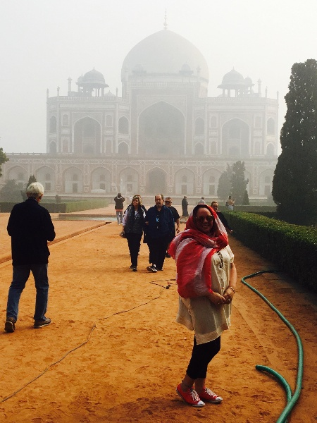

# Python implementation of DCP-based image dehazing algorithms

Python implementation of *Single image haze removal using dark channel prior* proposed by He, K., Sun, J., & Tang, X. (2010)

This repository also contains implementations of other DCP-based image dehazing algorithms.

## Requirements

- numpy
- opencv-python
- scipy

## Usage

```
python3 main.py -i /path/to/input/image --verbose
```

### Options

#### Show options

```
python3 main.py -h
```

#### Details

- `--t_mode`

    - `mul` (default)
        $$\tilde{t}(x) = 1 - \omega \min\limits_{y\in \Omega(x)}(\min\limits_{c}\frac{I^c(y)}{A^c})$$
    
    - `add`: proposed by [[3]](#reference)
        $$\tilde{t}(x) = 1 - \min\limits_{y\in \Omega(x)}(\min\limits_{c}\frac{I^c(y)}{A^c}) + p$$

- `--refine_alg`

    - default: soft matting + bilateral filter
    - soft_matting
    - bilateral
    - cross_bilateral
    - guided_filter

- `--color_correct`: proposed by [[4]](#reference)

    $$J^c(x) = \frac{I^c(x) - (A^c - d^c)}{\max(t(x), t_0)} + (A^c - d^c)$$

## Results

| Input                        | Output                     |
| :--------------------------: | :------------------------: |
|  |  |

## Reference

1. He, K., Sun, J., & Tang, X. (2010). Single image haze removal using dark channel prior. IEEE transactions on pattern analysis and machine intelligence, 33(12), 2341-2353.
2. Lee, S., Yun, S., Nam, J. H., Won, C. S., & Jung, S. W. (2016). A review on dark channel prior based image dehazing algorithms. EURASIP Journal on Image and Video Processing, 2016, 1-23.
3. Xu, H., Guo, J., Liu, Q., & Ye, L. (2012, March). Fast image dehazing using improved dark channel prior. In 2012 IEEE international conference on information science and technology (pp. 663-667). IEEE.
4. Huang, S. C., Chen, B. H., & Wang, W. J. (2014). Visibility restoration of single hazy images captured in real-world weather conditions. IEEE Transactions on Circuits and Systems for Video Technology, 24(10), 1814-1824.
5. He, K., Sun, J., & Tang, X. (2012). Guided image filtering. IEEE transactions on pattern analysis and machine intelligence, 35(6), 1397-1409.
6. [Python implementation of closed-form matting](https://github.com/MarcoForte/closed-form-matting)