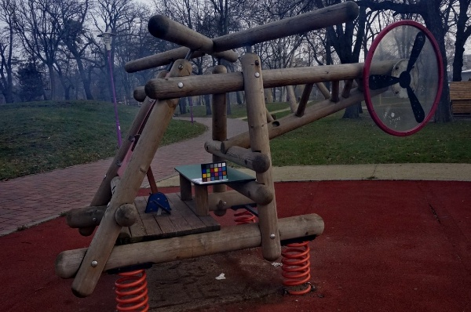

# Python implementation of DCP-based image dehazing algorithms

Python implementation of *Single image haze removal using dark channel prior* proposed by He, K., Sun, J., & Tang, X. (2010)

This repository also contains implementations of other DCP-based image dehazing algorithms.

## Requirements

- numpy
- opencv-python
- scipy

## Usage

```python
from dcp_dehaze import dcp_dehaze

dehaze = dcp_dehaze(input_image, **kwargs)
```

## Results

| Input                        | Output                     |
| :--------------------------: | :------------------------: |
|  |  |

## Reference

1. He, K., Sun, J., & Tang, X. (2010). Single image haze removal using dark channel prior. IEEE transactions on pattern analysis and machine intelligence, 33(12), 2341-2353.
2. Lee, S., Yun, S., Nam, J. H., Won, C. S., & Jung, S. W. (2016). A review on dark channel prior based image dehazing algorithms. EURASIP Journal on Image and Video Processing, 2016, 1-23.
3. [Python implementation of closed-form matting](https://github.com/MarcoForte/closed-form-matting)